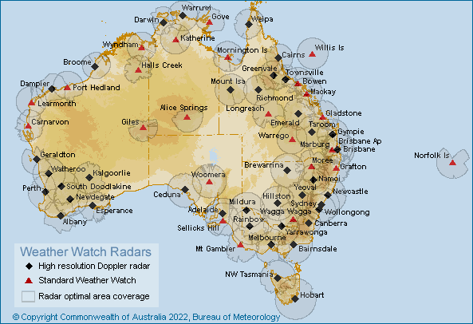

# bomthegov Help

## Rain and Wind Radars

**bomthegov** fetches radar images that the Australien [sic] Bureau of Meteorology (BOM) publishes on its FTP server.

These can show the location of rain, with different colours used to depict rainfall intensity, or the direction of wind.

As the BOM [explains](http://www.bom.gov.au/australia/radar/about/):

> Radars send out signals which can be reflected back by precipitation to detect rain.
>
> The radars don't "see" clouds (as cloud droplets are too small) but do "see" the rain droplets that clouds produce, as the droplets "echo back" the radar signals. This means that the rain radars may sometimes detect echoes from aircraft, areas of smoke/ash from large fires, swarms of insects, flocks of birds, or even the ground or sea surface, when unusual atmospheric conditions bend the radar beam back down to the surface. As a result, there may be patterns on the radar images that do not represent falling rain.
>
> The radar images display rainfall echoes from clouds located between 2500m and 3500m above ground. At this height, the optimal radar coverage extends to 200km from each radar. The coverage may also be impacted by interference as described above.
>
> Generally, the optimal coverage area extends to approximately 200km away from the radar. Beyond this distance some rainfall echoes may be displayed on the radar image, however these echoes will be from clouds higher up in the atmosphere and will not directly correspond with conditions experienced on the ground.

BOM currently operates over 60 radars.

BOM labels each image set with a unique identifier. Radar image identifiers start with the prefix 'IDR.'

You can ask **bomthegov** to return a list of available radars and the IDs, by running:

  `bash bomthegov radar list`

From there you'll see the radar image set ID, a short description about its location, camera view, and the "delete time" (or DelT).

## DelT

Delete Time (Delt) refers to how many hours an image set will be available on the BOM public archive server, before it is replaced with new imagery. For instance, most radar image sets have a DelT of '1.2' and this means that images that are older than 72 minutes from the current time will no longer be available on the server. Or said another way, all images from the past 1.2 hours are currently available.

## Fetching

If you know the ID of the radar image set you want to fetch, you can start right away by passing **bomthegov** its ID. For example, you can start downloading the "512km x 512km Gulf of Carpentaria" rain radar by specifying the `IDR361` identifier, like this:

  `bash bomthegov radar IDR361`

To find the list of radars and IDs, use:

  `bash bomthegov radar list`

### Matching times

In addition to passing an ID to **bomthegov**, you can also specify a specific time that you're interested in fetching only. This will fetch only images that match the time you specify, ignoring other times.

All time formats are in 24hr time, in UTC (Coordinated Universal Time).

So for example, with the `IDR361` radar from the example above, if you only wish to collect images that are available from that set from 3:06pm UTC, you would type:

  `bash bomthegov radar IDR361 15:06`

### Globbing

In an extension of the above, with matching times, you can also specify a 'wildcard' to set a pattern of specific times you wish to match only. This is done with something called 'globbing' which is just a silly name for a specific type of pattern matching.

**bomthegov** can accept the question mark character as a wildcard, which is interpreted as "any digit here, for the length of one digit."

Some examples might make this clear:

  * A pattern of `09:2?` will fetch images from *any* minute inside twenty past nine.

  * A pattern of `20:?4` will fetch any image inside any ten minute range ending with 4 (i.e. 04, 14, 24, 34, 44, and 54), inside eight o'clock.

  * A pattern of `13:??` will fetch all images available inside 1pm only.

Globbing is currently only available for minute ranges.

**Please note**

The "delete time" (DelT) for most radar images is 1.2hrs, so this setting is mostly only useful when bomthegov is running as an automated job (for example, a cronjob), as a glob pattern outside DelT will not return any matches, and hence capture no images.

You can run the 'list' option to get data on each radar's DelT:

  `bash bomthegov radar list`

### Examples

Fetch the full available set of imagery for the `IDR361` ID:

  `bash bomthegov radar IDR361`

Fetch only images from 3:06pm:

  `bash bomthegov IDR361 15:06`

Fetch only images from *any* minute inside twenty past nine:

  `bash bomthegov IDR361 09:2?`

