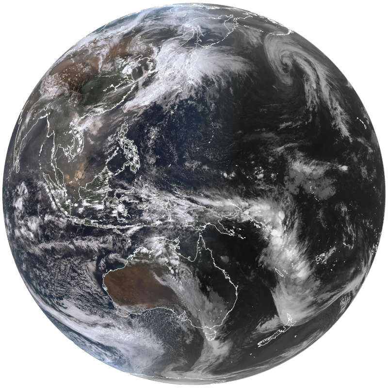
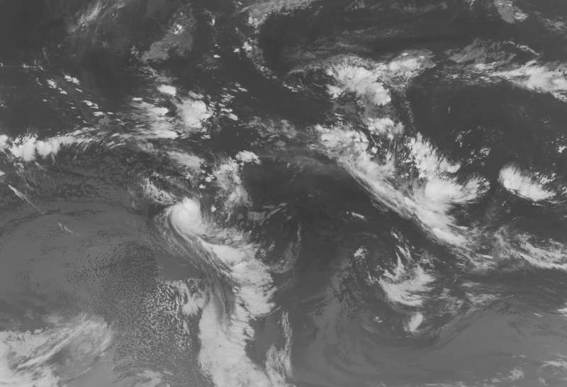

# bomthegov Help

## Satellites

**bomthegov** fetches satellite images that the Australien [sic] Bureau of Meteorology (BOM) publishes on its FTP server.

BOM receives modern satellite images from Himawari-8, a geostationary satellite operated by the Japan Meteorological Agency (JMA), and legacy imagery from JMA's Multi-functional Transport Satellites (MTSAT) (which are now depreciated).

Himawari-8 is situated 35,800km above the equator, in line with Japan, Papua and central Australia.

The following types of imagery are currently available:

  * Infrared images
  * Visible images
  * Clouds/surface composite images

BOM labels each image set with a unique identifier. Satellite image identifiers start with the prefix 'IDE.'

You can ask **bomthegov** to return a list of available satellites and the IDs, by running:

  `bash bomthegov satellite list`

From there you'll see the satellite image set ID, a short description about its camera view and image type, resolution, and the "delete time" (or DelT).

## DelT

Delete Time (Delt) refers to how many hours an image set will be available on the BOM public archive server, before it is replaced with new imagery. For instance, most satellite image sets have a DelT of '24' and this means that images that are older than 24 hours from the current time will no longer be available on the server. Or said another way, all images from the past 24 hours are currently available.

In another example, some legacy satellite image sets at the moment are kept for 504 hours (21 days), and so where the DelT is '504,' this means images from the past "504 hours" are available.

## Search

You can ask **bomthegov** to return a list of available satellites and the IDs as searchable text, by running:

  `bash bomthegov satellite search`

From there you'll see the satellite image set ID, a short description about its view/camera, etc.

To search the text, press the `/` key, type your search query, and press `[Enter]`. Any matches to your search query will now be highlighted in the list.

You can navigate the list by using the arrow keys, and `[Page Up]` and `[Page Down]` keys.

`[Spacebar]` will scroll down 'a screen length,' and likewise, the `[Home]` and `[End]` keys will take you to the top and bottom of the list respectively.

## Fetching

If you know the ID of the satellite image set you want to fetch, you can start right away by passing **bomthegov** its ID. For example, you can start downloading the "geostationary full disc satellite view" in "visual true colour & infrared greyscale composite" by specifying the `IDE00426` identifier, like this:

  `bash bomthegov satellite IDE00426`

To find the list of satellites and IDs, use:

  `bash bomthegov satellite list`

### Matching times

In addition to passing an ID to **bomthegov**, you can also specify a specific time that you're interested in fetching only. This will fetch only images that match the time you specify, ignoring other times.

All time formats are in 24hr time, in UTC (Coordinated Universal Time).

So for example, with the `IDE00426` satellite from the example above, if you only wish to collect images that are available from that set from 2:30am UTC, you would type:

  `bash bomthegov satellite IDE00426 02:30`

### Globbing

In an extension of the above, with matching times, you can also specify a 'wildcard' to set a pattern of specific times you wish to match only. This is done with something called 'globbing' which is just a silly name for a specific type of pattern matching.

**bomthegov** can accept the question mark character as a wildcard, which is interpreted as "any digit here, for the length of one digit."

Some examples might make this clear:

  * A pattern of `09:2?` will fetch images from *any* minute inside twenty past nine.

  * A pattern of `20:?4` will fetch any image inside any ten minute range ending with 4 (i.e. 04, 14, 24, 34, 44, and 54), inside eight o'clock.

  * A pattern of `13:??` will fetch all images available inside 1pm.

Globbing is currently only available for minute ranges.

**Please note**

The "delete time" (DelT) for some satellite images is less than 24hrs, so this setting is mostly only useful when **bomthegov** is running as an automated job (for example, a cronjob), as a glob pattern outside DelT will not return any matches, and hence capture no images.

You can run the 'search' option to get data on each satellite's DelT:

  `bash bomthegov satellite search`

### Examples

Fetch the full available set of imagery for the `IDE00426` ID:

  `bash bomthegov satellite IDE00426`

Fetch only images from 2:30am:

  `bash bomthegov satellite IDE00426 02:30`

Fetch only images from *any* minute inside twenty past nine:

  `bash bomthegov satellite IDE00426 09:2?`

### Himawari-8 Examples

| ID        | Example Image                                     |
| --------- | ------------------------------------------------- |
| IDE00401  |                   |
| IDE00402  |                   |
| IDE00403  |                   |
| IDE00404  |                   |
| IDE00405  |                   |
| IDE00406  |                   |
| IDE00407  |                   |
| IDE00409  |                   |
| IDE00411  |                   |
| IDE00412  |                   |
| IDE00416  |                   |
| IDE00420  |                   |
| IDE00421  |                   |
| IDE00422  |                   |
| IDE00423  |                   |
| IDE00425  |                   |
| IDE00426  |                   |
| IDE00427  |                   |
| IDE00430  |                   |
| IDE00431  |                   |
| IDE00432  |                   |
| IDE00433  |                   |
| IDE00435  |                   |
| IDE00436  |                   |
| IDE00437  |                   |

